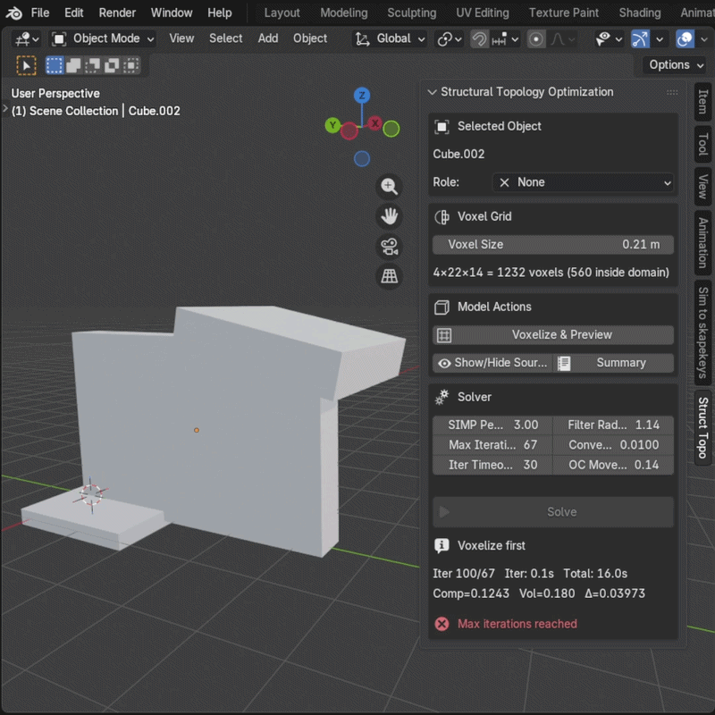
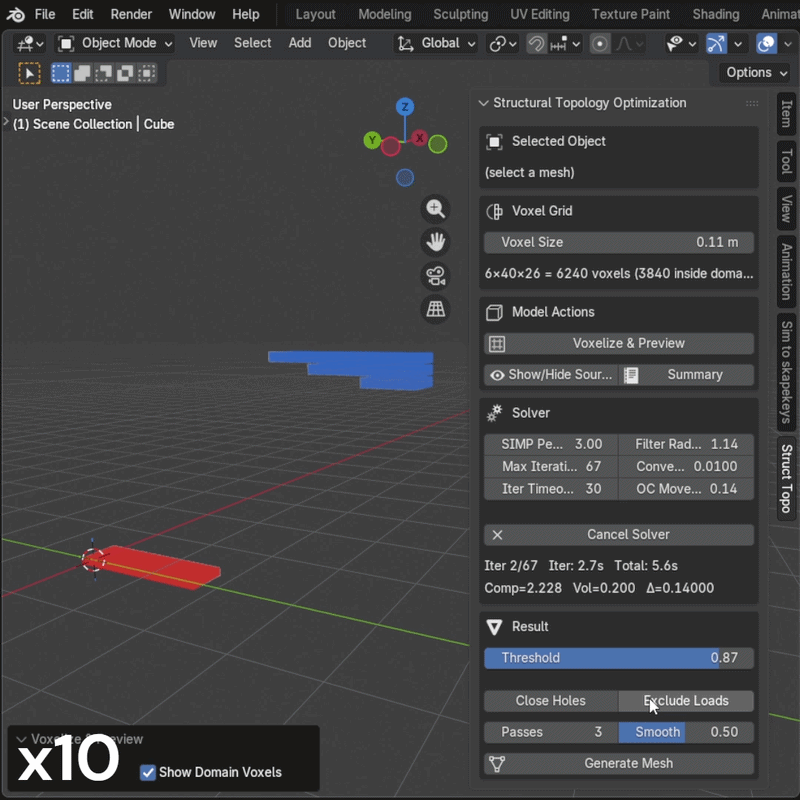

# Structural Topology Optimization for Blender

  

A Blender addon for early-stage structural topology optimization, intended as a tool for **geometry discovery** through analyzing applied loads, boundary conditions and material distribution within the given design space.

Inspired by [TopOpt_teach](https://github.com/MCM-QMUL/TopOpt_teach/tree/main), the addon implements a simplified 3D SIMP (Solid Isotropic Material with Penalization) solver and wraps it in Blender's 3D viewport — so you can sketch a design space, tag loads and supports on regular meshes, and quickly visualize where material "wants" to be in a voxelized manner. The aim is to give designers and curious tinkerers a low-friction way to *see* candidate shapes early in a process, without relying on closed or commercially available topology optimization software.

To be clear upfront regarding Blender implementation: this is *structural* topology optimization — finding where material should go inside a design domain to carry given loads — not **mesh topology** editing in the Blender sense (edge flow, retopology, etc.). Blender isn't traditionally a place where this kind of FEA-adjacent solver lives, which is exactly what made it an interesting experiment: its python scripting and viewport/modelling make it easy to sketch a design space and visualize results, even if it was never built with solvers in mind.

> 💡 Structural mechanics isn't my domain, so treat results as visual sketches rather than verified designs — verify anything load-bearing with proper FEA tools. The solver also runs on CPU for now, so larger grids can get slow depending on the hardware.

---

## Installation

1. Download the latest `StructTopOpt_Blender_vX.X.X.zip` from [Releases](../../releases).
2. In Blender: **Edit → Preferences → Add-ons → Install…**, select the zip.
3. Enable **Object: Structural Topology Optimization**.
4. The panel appears in the **3D Viewport N-panel** under the **Struct Topo** tab.

`scipy` is bundled inside the zip — no extra installation required.

---

## Model Setup

Tag regular Blender mesh objects with roles from the **Struct Topo** panel. Each mesh is assigned a role and colored accordingly in the viewport.

| Role | Color | Purpose |
|---|---|---|
| **Boundary Domain** | Grey | The design space — the solver places material inside this volume. *Target Density*: volume fraction to fill (e.g. `0.3` = keep 30% as material). *Young's Modulus* and *Poisson's Ratio* define the material. |
| **Load** | Blue | Voxels here receive the applied force. *Direction*: XYZ vector for the force. *Total Force (kN)*: distributed equally across all load voxels. |
| **Support** | Red | Voxels here are fixed (Dirichlet boundary condition) |
| **Property Region** | Yellow | Voxels constrained to a fixed density. *Target Density*: `1.0` = force solid, `0.0` = force void. |

Once roles are assigned, set the **Voxel Size** and click **Voxelize & Preview**. The viewport switches to Material Preview and shows the voxelized domain as colored cubes. A DOF count and potential warning will be visible if the grid is large enough to make solving slow. (for now)

  

> Just to keep in mind, all transformations are applied to the selected geometries at voxelization.

---

## Solver

Run the solver with the **Solve** button. Progress is shown live — iteration count, compliance, volume fraction, and density change per iteration.

| Parameter | Default | Description |
|---|---|---|
| **SIMP Penalty** | `3.0` | Penalization exponent. Higher values push densities toward 0 or 1, giving crisper results but potentially slower convergence. |
| **Filter Radius** | `1.5` voxels | Smoothing radius for sensitivity filtering. Prevents checkerboard patterns. Increase if results look noisy. |
| **Max Iterations** | `80` | Hard stop if convergence isn't reached. |
| **Convergence Tol** | `0.01` | Stops when the maximum density change between iterations drops below this value. |
| **Iter Timeout** | `60` s | Cancels the solve if a single iteration exceeds this duration. Reduce grid resolution if this triggers. |
| **OC Move Limit** | `0.2` | Maximum density change allowed per OC step. Lower is more stable; higher converges faster but can oscillate. |

  

---

## Result & Preview

The **Threshold** slider controls which voxels are visible — only voxels with a density above the threshold are shown. At `0.8` you see the densest, most load-bearing material. Lowering it reveals transitional regions. The preview updates in real time as you drag the slider.

Click **Generate Mesh** to extract a mesh from the density field. Voxel boundary quads are extracted with NumPy, then two Remesh modifier passes clean up the geometry, followed by Laplacian smoothing.

| Option | Description |
|---|---|
| **Close Holes** | Fills open boundary edges to produce a watertight mesh. |
| **Include Loads** | Forces load voxels solid in the extracted mesh. |
| **Include Supports** | Forces support voxels solid in the extracted mesh. |
| **Passes** | Number of Laplacian smoothing passes applied after remeshing. |
| **Smooth** | Strength of each smoothing pass (`0` = off, `1` = maximum). |

> I highly suggest modelling the geometry manually based on the voxel and meshing results due to the potential artifacts and non-optimal topology generation of the current state of the add-on.

## Examples

<table align="center">
  <tr>
    <td align="center">
       
      <em>An example of organic bookshelf generation</em>
    </td>
    <td align="center">
       
      <em>description 2</em>
    </td>
    <td align="center">
       
      <em> description 3</em>
    </td>
  </tr>
</table>
